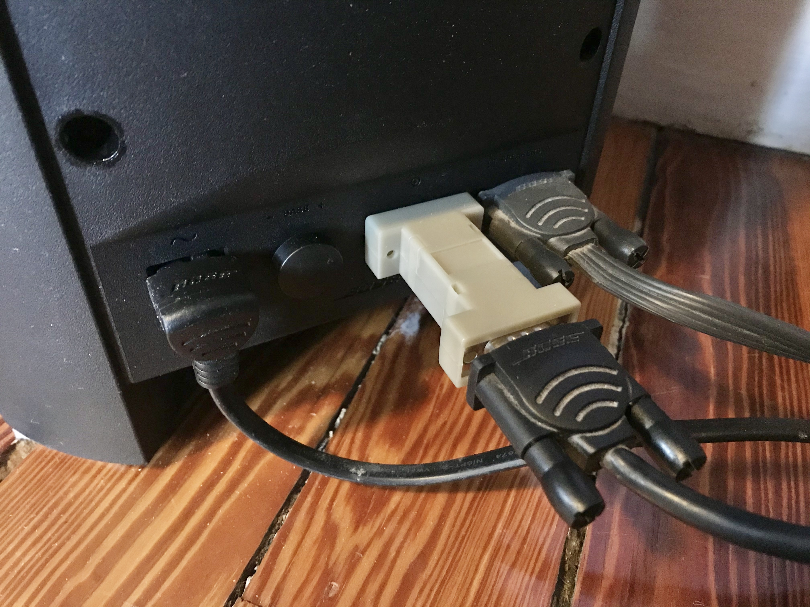
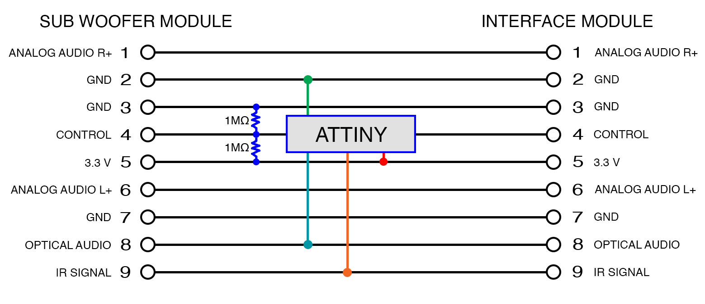
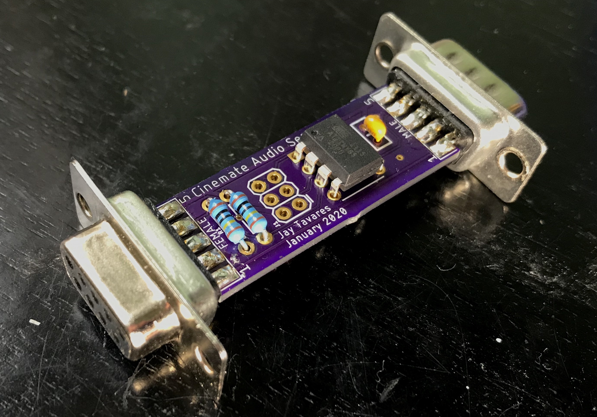
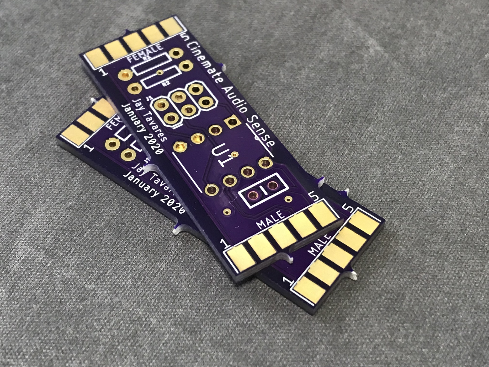

# Cinesense: an Audio Sensing Add-on for Bose Cinemate Speakers


## Overview
Do you have Bose Cinemate speakers? Do you wish they would just turn on automatically when you need them
and turn off when you're done. This project provides everything you need to do just that. Using it, you can create an
adapter that plugs into the interface module cable and adds audio sensing capability to your Bose Cinemate speakers.*

\* This project has only been tested with Bose Cinemate GS Series II speakers. I _think_ it should work with other
related models, but YMMV.

[Build It!](#the-parts-list)

### How It Works
When placed inline between the sub woofer module and the interface module, the Cinesense adapter repeatedly polls the 
optical audio input for a signal. When a signal is sensed, the speakers are automatically turned on. The adapter will 
continue to monitor the signal while the speakers are in use. Once the signal has stopped for ten seconds, the adapter 
will turn the speakers off.

NOTE: The adapter only looks at the optical input and will not respond to audio signals on the analog inputs. This is a 
potential future enhancement that can be made to the design. Also, the term "Audio Signal" here is referring to optical 
audio "data" which is not the same as "sound". It's possible for the optical audio signal to be present _and_ silent 
(e.g. music player is powered on but is paused).

Aside from the new found ability to automatically turn on and off in response to the audio signal, all aspects of the 
speakers are the same. You can still use your remote to control the volume and mute the speakers. You can even use your 
remote to turn the speakers off, though if there is an audio signal present, they'll just turn right back on again.

## Theory of Operation (for nerds)
Below I've included not just how the Cinesense works but everything I learned about these speakers in the course 
of building this project. Hopefully it will be helpful to someone else interested in hacking these speakers.



Some notes:

  - Pin 4 - Interface module CONTROL LINE
    - Has three possible states
      - LOW - power off
      - HIGH - power on, LED on
      - FLOAT - power on, LED off
        - This is how the LED is able to flash when the speakers are muted and in response to remote button presses.
        - This allows us to turn on the optical input without also turning on the LED in the interface module. 👍
  - Pin 8 - Optical audio
    - Digital audio data (Didn't seem to be at the same 3.3v logic level--it was lower.)
  - Pin 9 - IR Line
    - Decoded IR data (NEC protocol) with no carrier frequency

As you can see in the diagram above, the micro-controller interrupts the control line in order to allow independent control of the interface 
module. The control line input can be polled to determine the power state of the speakers, the resistors on the control 
line input act as a voltage divider allowing the micro-controller to accurately detect the floating state. By floating 
the control line output, the interface module can be turned on without lighting its LED or turning on the speakers. This
supplies power to the optical input and allows us to check for a signal. 

In my experimentation, it didn't appear that I could turn on the speakers by simply bringing the control line high. So, 
instead, when an audio signal is sensed, I inject the 'ON' infrared command directly into the IR Line. This simulates 
pressing the on button on the remote and the speaker system powers on in turn. Since we are tapping into the IR data line 
directly, we need only inject the command itself with no carrier frequency. These speakers use the NEC IR protocol. 
Here are the commands that they support:

  - 0x5D0532CD On/Off
  - 0x5D05C03F Vol. Up
  - 0x5D0540BF Vol. Down
  - 0x5D05807F Mute

## The Parts List
You'll need a few parts:

- 1x [Dual sided hood](https://www.showmecables.com/db9-hd15-vga-dual-sided-hood-plastic)
- 1x [DB9 Male connector](https://www.showmecables.com/db9-male-solder-connector)
- 1x [DB9 Female connector](https://www.showmecables.com/db9-female-solder-connector)
- 1x [ATTINY85 microchip](https://www.digikey.com/product-detail/en/microchip-technology/ATTINY85-20PU/ATTINY85-20PU-ND/735469)
- 2x [1㏁ resistors](https://www.digikey.com/short/zjj1fm) *
- 1x [.1µF capacitor](https://www.digikey.com/product-detail/en/kemet/C315C104M5U5TA/399-4151-ND/817927)
- 1x [2x3 header](https://www.digikey.com/product-detail/en/adam-tech/PH2-06-UA/2057-PH2-06-UA-ND/9830396) (_Optional_--only needed if you plan to program the chip on the board.)

\* Linked resistor should work, though I just used some spares I had on hand of unknown brand.

## The Tools
Naturally, you'll need soldering supplies to assemble the board. Once assembled, I use the [Pocket AVR Programmer](https://www.sparkfun.com/products/9825)
from SparkFun to program the chip.
 
## The Circuit Board



### Quick & Easy
For convenience, You can purchase the board on [OSHPark](https://oshpark.com/shared_projects/EzLrNW1y).

### Schematic and Board layout file
The board was designed using Eagle. If you need to make any modifications, you will find the original CAD files in the [board](./board) folder.

### Assembly


Before you start assembly, be sure to file off any tabs left on your boards as a result of panelization. If you skip this
step, you'll have trouble fitting the completed board into the housing. This is especially important for tabs along the 
short edges where the DB9 connectors attach. After removing the tabs, I dry fit the connectors on the board and placed 
everything in one half of the housing. I was then able to tack solder the connectors in place to ensure the final 
assembly would fit in the housing. 

## The Software

### Use Precompiled software (Easiest option)
 1. Download the most recent `firmware.hex` file from the [Releases](https://github.com/jaytavares/cinesense/releases) page.
 2. Connect your AVR Programmer to the chip. (I've included an ISP header on the board if you don't have a standalone programmer for ATTINY chips.)
 3. Use [avrdude](http://savannah.nongnu.org/projects/avrdude/) to program the ATTINY chip. Assuming you're using the "Pocket AVR Programer", run:
```
$ avrdude -c usbtiny -p t85 -U lfuse:w:0xe2:m -U hfuse:w:0xdf:m -U efuse:w:0xff:m -U flash:w:firmware.hex:i
```

### Build from the source (Most flexible option)
If you would like to customize your Cinesense, you'll have to build the software from the source. The software for this project is built using the fantastic [PlatformIO](https://platformio.org). 

#### Programming the chip
 1. Connect your AVR Programmer to the chip. (I've included an ISP header on the board if you don't have a standalone programmer for ATTINY chips.)
 2. In the root directory of this project, run:
```
platformio run
```
This should compile the software, burn the correct fuses, and upload the software to the chip.

## Legal
This project is licensed under the MIT License. See [LICENSE.txt](LICENSE.txt) for more information. "Bose" and "Cinemate" are registered trademarks of Bose Corporation, Framingham, MA. This project is not endorsed by or affiliated with the Bose Corporation.
